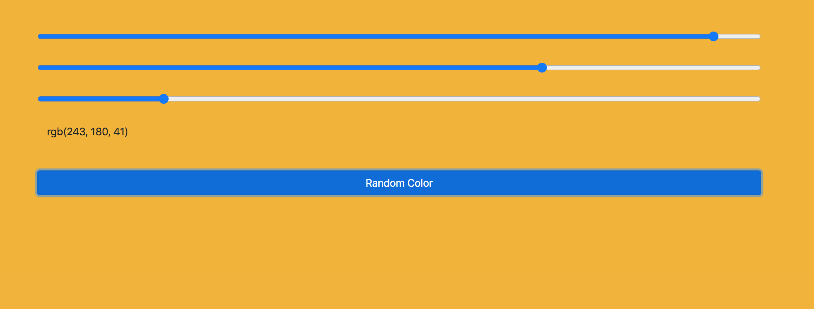
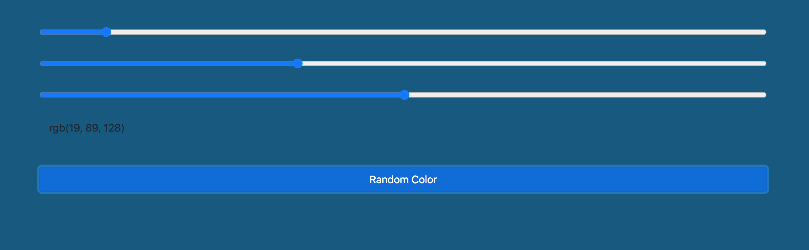
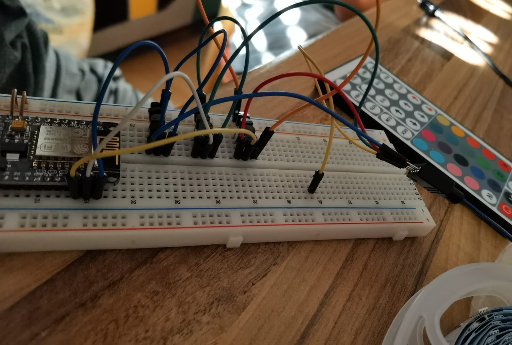
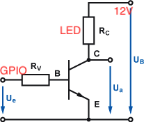

# ColorPicker
ESP8266 RGB Color Picker

- uses Capture Portal
- return value from API to Frontend
- random colors
- extendable with more individuals RGBs
- PWM to control colors

## Web Page - Example

=> rgb(r, g, b) is the return value from the hardware API

## Hardware

For each color a seperate circuit

# Pins GPIO

const int ledr = 4;

const int ledg = 5;

const int ledb = 16;

# IP Address and Port

IPAddress apIP(172, 217, 28, 1);

ESP8266WebServer server(80);
